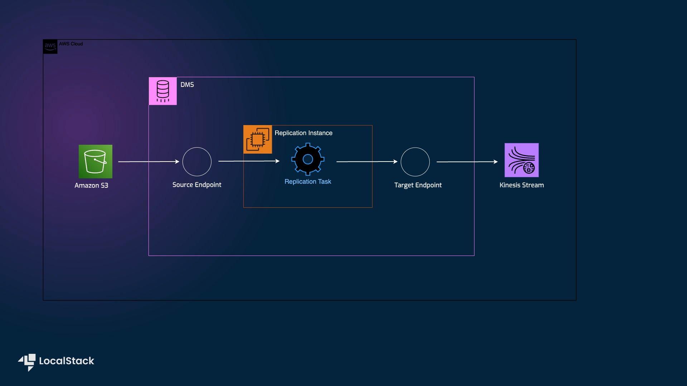

# Sample Application showcasing how to use DMS with s3 source and kinesis target

## Introduction

This scenario demonstrates how to use Database Migration Service (DMS) to create change data capture (CDC) and full load tasks using the Cloud Development Kit in Python. It is a self-contained setup that will create a VPC to host the DMS replication instance, an S3 bucket as the data source, a Kinesis stream as the target, and the replication tasks.



## Pre-requisites

-   [LocalStack Auth Token](https://docs.localstack.cloud/getting-started/auth-token/)
-   [Python 3.10](https://www.python.org/downloads/) & `pip`
-   [Docker Compose](https://docs.docker.com/compose/install/)
-   [CDK](https://docs.localstack.cloud/user-guide/integrations/aws-cdk/)  with the  [`cdklocal`](https://github.com/localstack/aws-cdk-local) wrapper.

  
Start LocalStack Pro with the `LOCALSTACK_AUTH_TOKEN`  pre-configured:

```bash
export LOCALSTACK_AUTH_TOKEN=<your-auth-token>
docker-compose up
```

The Docker Compose file will start LocalStack Pro container and a MariaDB container. The MariaDB container will be used to showcase how to reach a database external to LocalStack.

## Instructions

### Install the dependencies

Install all the dependencies by running the following command:

```bash
make install
```

### Creating the infrastructure

To deploy the infrastructure, you can run the following command:

```bash
make deploy
```

After successful deployment, you will see the following output:

```bash
Outputs:
DmsS3ToKinesisStack.cdcTask = arn:aws:dms:us-east-1:000000000000:task:WLVQO3DQTCC31K5OGLN9ZQI1J6X88GF9T4PKLY8
DmsS3ToKinesisStack.fullLoadTask = arn:aws:dms:us-east-1:000000000000:task:AJGNKCENBYN0UZFYCLIU62WEH9NF62713YTKJZU
DmsS3ToKinesisStack.kinesisStream = arn:aws:kinesis:us-east-1:000000000000:stream/DmsS3ToKinesisStack-TargetStream3B4B2880-6e4a4e31
DmsS3ToKinesisStack.s3Secret = arn:aws:secretsmanager:us-east-1:000000000000:secret:DmsS3ToKinesisStack-s3accesssecret988D0EB7-79f34adc-scxavJ
DmsS3ToKinesisStack.sourceBucket = source-bucket-s3-kinesis-dms
Stack ARN:
arn:aws:cloudformation:us-east-1:000000000000:stack/DmsS3ToKinesisStack/edecb02a

✨  Total time: 36.43s
```

### Running the tasks

You can run the tasks by executing the following command:

```bash
make run
```

## Developer Notes

Two tasks are deployed with the stack:

First, a full load replication task runs against the S3 source:

-   Creates three tables: `employee`, `department`, `project`
-   Uploads sample CSV data for each table to the S3 bucket
-   Starts the full load task
-   Captures and logs Kinesis events for the uploaded data: 3 create table, 3 drop table, 10 inserts
-   Logs `table_statistics` for the task

Next, a CDC replication task runs against the RDS database:

-   Creates three tables: `employee`, `department`, `project`
-   Uploads sample CSV data for each table to the S3 bucket
-   Captures and logs Kinesis events for the uploaded data: 3 create table, 4 inserts, 3 updates, 4 deletes, 1 table for `awsdms_apply_exceptions`
-   Logs `table_statistics` for the task

Two tasks perform full load replication on Dockerized MariaDB. The other two perform CDC replication on a MariaDB RDS database.

All tasks target the same Kinesis Stream.

## Deploying on AWS

You can deploy and run the stack on AWS by running the following commands:

```bash
make deploy-aws
make run-aws
```

## License

This project is licensed under the Apache 2.0 License.
